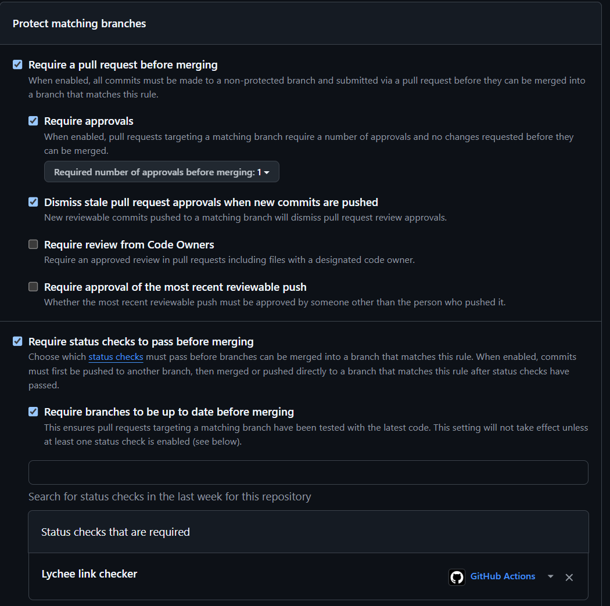
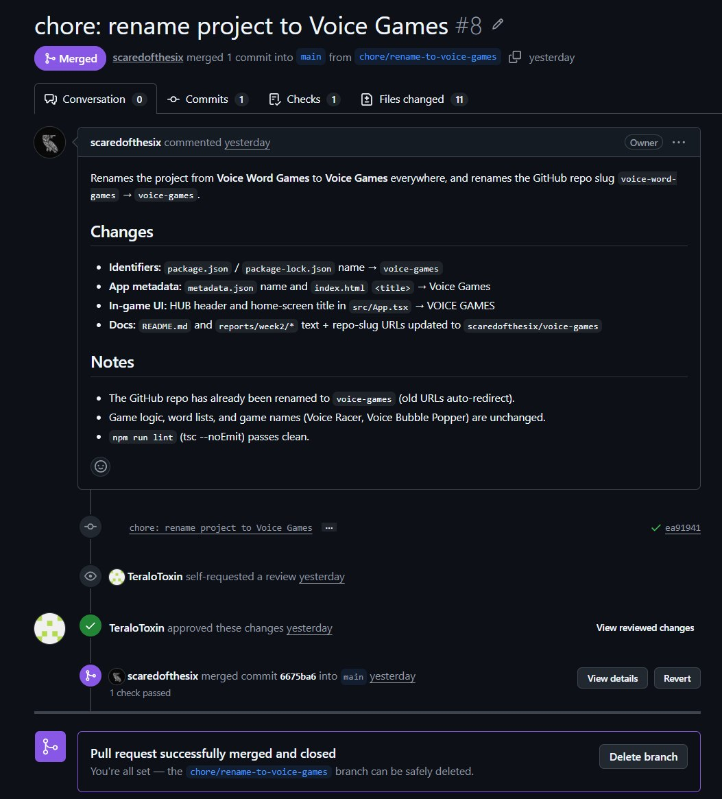
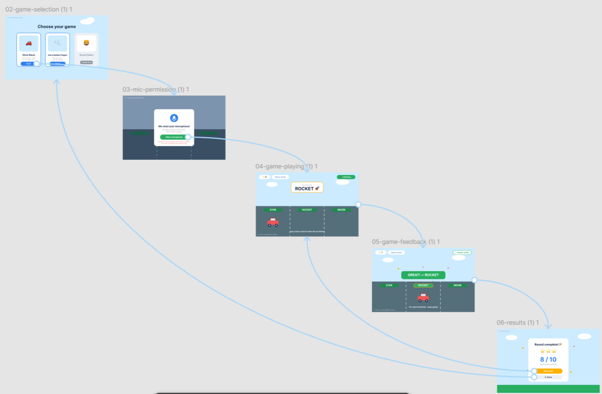
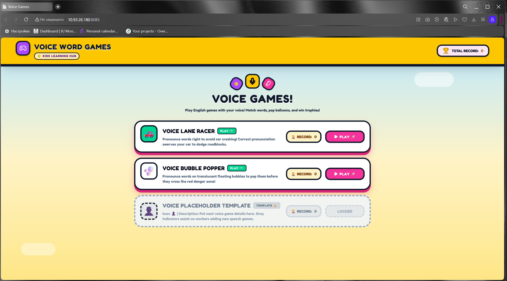

# Assignment 2 - Week 2 Report (Team 40)

**Project:** Voice Games - a browser-based platform of voice-controlled English word games for children (games: *Voice Racer*, *Voice Bubble Popper*).
**License:** [MIT](../../LICENSE)

> This file is the public index for the Assignment 2 submission. Substantive content lives in the dedicated files linked below.

## User stories & MVP v1 scope
- [User stories](./user-stories.md) - 10+ stories with stable IDs, MoSCoW priorities, and the initial proposed MVP v1 scope.

## Prototype & interface artifacts (graphical product)
- **Interactive prototype (Figma, public view-only):** https://www.figma.com/proto/zOC2O3B3IuW1YvMa222XuX/Voice-Word-Games-%E2%80%94-Prototype--Team-40-?node-id=20-151 - clickable navigation between screens (open in Present mode).
- Prototype screen sources: [./prototype/](./prototype/README.md) (6 SVG screens).
- Screens covered: Home -> game selection -> main game (microphone interaction) -> results.

## MVP v0
- [MVP v0 report](./mvp-v0-report.md)
- Deployment URL: https://10.93.26.180:8085/ (hosted on the Innopolis VM; reachable from the Innopolis network/VPN). Open in Google Chrome and accept the self-signed certificate warning.
- Public video demonstration (<2 min): https://disk.yandex.ru/i/3aCIJDDw9Tat4Q
- Run instructions: [root README](../../README.md#1-local-development-setup)

## Workflow & link checking
- Minimal PR template: [.github/PULL_REQUEST_TEMPLATE.md](../../.github/PULL_REQUEST_TEMPLATE.md)
- PRs through the protected-branch workflow: [PR #1 - ci: add missing Lychee link-check workflow](https://github.com/scaredofthesix/voice-games/pull/1) (Lychee check passed, squash-merged). Reviewed PR with teammate review: [PR #8 - chore: rename project to Voice Games](https://github.com/scaredofthesix/voice-games/pull/8) (reviewed and approved by teammate TeraloToxin, Lychee check passed, merged).
- Default branch `main` is protected: merges only via pull request with one required approving review, required "Lychee link checker" status check, rules enforced for administrators, force pushes and branch deletion disabled.
- Lychee configuration: [lychee.toml](../../lychee.toml) · Workflow: [.github/workflows/links.yml](../../.github/workflows/links.yml) · Latest successful protected-branch run: [run 27288376055](https://github.com/scaredofthesix/voice-games/actions/runs/27288376055)
- **Excluded Lychee links + justification:**
  - `localhost` / `127.0.0.1` - dev-only URLs not reachable from CI.
  - `https://www.figma.com/...` (design / proto) - Figma returns 403 Forbidden to anonymous clients even with public view sharing enabled; **manually verified in a browser** (the prototype opens in Present mode).
  - `https://10.93.26.180:8085/` - the MVP v0 deployment on the Innopolis VM (private IP, self-signed certificate); not reachable from GitHub CI; **manually verified in the browser on the Innopolis network**.

## Customer review
- [Customer meeting summary](./customer-meeting-summary.md) (2026-06-13; user stories, MoSCoW priorities, and MVP v1 scope approved).
- [Customer meeting transcript](./customer-meeting-transcript.md) - sanitized, published with the customer's permission. The recording is shared privately with instructors via Moodle.

## Analysis & LLM usage
- [Week 2 analysis](./analysis.md)
- [LLM usage report](./llm-report.md)

## Screenshots (from ./images/)

**Protected default branch settings**

**Example reviewed PR (reviewed by teammate, not a self-review)**

**Selected prototype & interface artifacts**

**Deployed MVP v0**

## Coverage
- **Initial proposed MVP v1 scope** (from [user-stories.md](./user-stories.md)): US-01, US-02, US-04, US-07, US-08.
- **Prototype** covers stable IDs: US-01, US-02, US-04, US-07 (with US-03, US-05, US-06 represented as elements/states within the game and results screens).
- **MVP v0** foundation relationship to stories: see [mvp-v0-report.md](./mvp-v0-report.md) and its repeatable smoke check (realizes parts of US-01, US-02, US-04, US-06, US-07).
